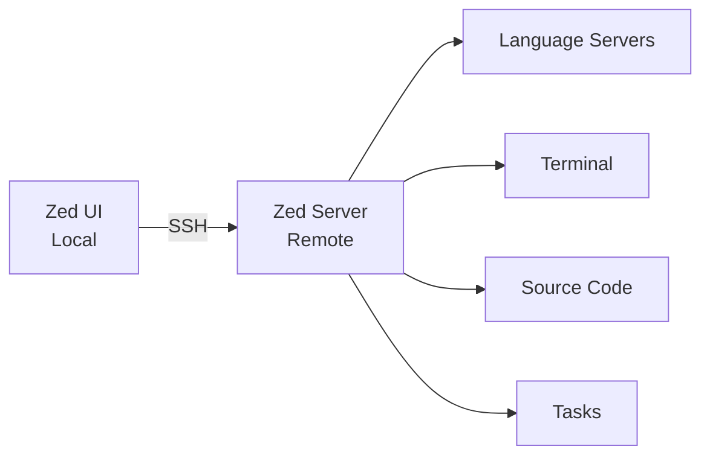

# Remote Development

Remote Development lets you edit code on a remote server while running Zed's UI locally. This provides the best of both worlds: responsive local interface with the power of remote computing.

## How It Works

Zed's remote development architecture splits responsibilities:

**Local (Your Machine):**
- Zed UI (fast, responsive interface)
- Syntax highlighting (Tree-sitter)
- AI model communication
- Unsaved changes storage
- Settings and keybindings

**Remote (Server):**
- Source code files
- Language servers (LSP)
- Terminal sessions
- Tasks and build processes
- Git operations



<Note>
As of Zed v0.157, remote development uses direct SSH connections. The previous server-proxied mode is no longer available.
</Note>

## Setup

### Requirements

**Local Machine:**
- Zed v0.159 or later
- SSH client installed (`ssh` command available)

**Remote Server:**
- macOS Catalina+ (Intel or Apple Silicon) **or**
- Linux (x86_64 or arm64)
- SSH access with key-based authentication (recommended)
- Internet access to download the Zed server binary

<Warning>
Windows is not yet supported as a remote server platform. You can use Windows as the local machine to connect to remote Linux/macOS servers.
</Warning>

### First Connection

1. **Open Remote Projects Dialog**
   - Press `Cmd+Shift+P` (macOS) or `Ctrl+Shift+P` (Linux/Windows)
   - Search for "Open Remote Projects" and select it
   - Or use the keybinding for `projects::OpenRemote`

2. **Connect to Server**
   - Click "Connect New Server"
   - Enter your SSH command: `user@hostname` or `ssh user@hostname -p 2222`
   - Zed will establish the SSH connection and prompt for credentials if needed

3. **Server Initialization**
   - Zed automatically downloads and installs the server binary on the remote machine
   - The server is stored in `~/.zed_server/` on the remote host
   - Version matches your local Zed version

4. **Open a Project**
   - Select a directory on the remote server to open
   - The project opens just like a local folder

<Tip>
For quick access, use the command line: `zed ssh://user@host/path/to/project`
</Tip>

## Configuration

SSH connections are stored in your settings file (`~/.config/zed/settings.json`).

### Basic Configuration

```json
{
  "ssh_connections": [
    {
      "host": "192.168.1.10",
      "username": "myuser",
      "port": 22,
      "projects": [
        { "paths": ["~/code/myproject"] }
      ]
    }
  ]
}
```

### SSH Options

Pass additional SSH arguments:

```json
{
  "ssh_connections": [
    {
      "host": "work-server",
      "args": ["-i", "~/.ssh/work_key", "-o", "StrictHostKeyChecking=no"],
      "projects": [{ "paths": ["~/work/project"] }]
    }
  ]
}
```

### Zed-Specific Options

<Accordion title="Upload Binary Over SSH">
By default, Zed downloads the server binary from the internet on the remote host. If your server has restricted internet access, upload the binary from your local machine instead:

```json
{
  "ssh_connections": [
    {
      "host": "restricted-server",
      "upload_binary_over_ssh": true
    }
  ]
}
```
</Accordion>

<Accordion title="Nickname">
Give servers friendly names to distinguish them in the UI:

```json
{
  "ssh_connections": [
    {
      "host": "192.168.1.10",
      "nickname": "Dev Server"
    }
  ]
}
```
</Accordion>

### SSH Config File

Zed inherits settings from your `~/.ssh/config` file:

```ssh-config
Host dev-server
  HostName 192.168.1.10
  User myuser
  IdentityFile ~/.ssh/dev_key
  Port 2222
```

Then in Zed, just use the hostname:

```json
{
  "ssh_connections": [
    {
      "host": "dev-server",
      "projects": [{ "paths": ["~/code"] }]
    }
  ]
}
```

## Port Forwarding

Forward ports from the remote server to your local machine, useful for accessing web servers or databases.

### Basic Port Forward

```json
{
  "ssh_connections": [
    {
      "host": "dev-server",
      "port_forwards": [
        {
          "local_port": 8080,
          "remote_port": 80
        }
      ]
    }
  ]
}
```

Now `localhost:8080` on your machine connects to port 80 on the remote server.

### Advanced Port Forwarding

Bind to specific interfaces and forward to different hosts:

```json
{
  "port_forwards": [
    {
      "local_port": 8080,
      "remote_port": 3000,
      "local_host": "0.0.0.0",
      "remote_host": "docker-container"
    }
  ]
}
```

- **`local_host`** - Interface to bind on your machine (default: `localhost`)
- **`remote_host`** - Target host on the remote network (default: `localhost`)

## WSL Support

Zed on Windows natively supports Windows Subsystem for Linux (WSL).

### Open Local Folder in WSL

1. Use Command Palette: `projects: open in wsl`
2. Select the folder
3. Choose your WSL distribution

The folder opens as a remote project within the WSL container.

### Open Folder Already in WSL

1. Use Command Palette: `projects: open wsl`
2. Select the WSL distribution
3. The distribution appears in Remote Projects
4. Navigate to your folder

## Settings Management

Three settings locations are relevant for remote projects:

1. **Local Zed Settings** (`~/.config/zed/settings.json` on your machine)
   - UI preferences (font size, theme, keybindings)
   - Local AI settings

2. **Server Zed Settings** (`~/.config/zed/settings.json` on the remote server)
   - Language server paths
   - Proxy configuration
   - Server-specific tool paths

3. **Project Settings** (`.zed/settings.json` in the project)
   - Indentation settings
   - Formatter configuration
   - Language-specific settings

<Tip>
**Rule of thumb:** UI settings go in local settings, development tool settings go in server settings, and project-specific settings go in project settings.
</Tip>

### Example Settings Distribution

**Local settings (your machine):**
```json
{
  "theme": "One Dark",
  "buffer_font_size": 14,
  "ui_font_size": 16
}
```

**Server settings (remote machine):**
```json
{
  "lsp": {
    "rust-analyzer": {
      "binary": {
        "path": "/usr/local/bin/rust-analyzer"
      }
    }
  },
  "proxy": "http://proxy.company.com:8080"
}
```

**Project settings (`.zed/settings.json` in project):**
```json
{
  "languages": {
    "Python": {
      "format_on_save": "on",
      "formatter": "black"
    }
  },
  "tab_size": 4
}
```

## Proxy Configuration

Remote servers don't use your local proxy configuration. Configure the proxy on the remote server itself.

### Environment Variables

Set in `~/.bashrc` or `~/.zshrc` on the remote server:

```bash
export http_proxy="http://proxy.example.com:8080"
export https_proxy="http://proxy.example.com:8080"
export no_proxy="localhost,127.0.0.1"
```

### Zed Settings

Or configure in the remote server's Zed settings:

```json
{
  "proxy": "http://proxy.example.com:8080"
}
```

See [proxy documentation](https://zed.dev/docs/reference/all-settings#network-proxy) for supported types.

## Remote Terminal

Terminals in remote projects run on the remote server.

**Open terminal:** `` Ctrl+` `` (works the same as local projects)

The terminal:
- Runs your remote shell
- Has access to remote environment variables
- Can execute commands on the remote filesystem
- Supports all standard terminal features (tabs, splits, vi mode)

See [Terminal documentation](https://zed.dev/docs/terminal) for features.

## Remote Tasks

Tasks run on the remote server when working in a remote project.

**Run task:** `Cmd+Shift+P` → "Run Task" (or configured keybinding)

Tasks can:
- Execute build scripts on the remote server
- Run tests using remote dependencies
- Start development servers accessible via port forwarding

See [Tasks documentation](https://zed.dev/docs/tasks) for configuration.

## Remote Debugging

The debugger works in remote projects:

1. Configure your debugger in `.zed/tasks.json` on the remote project
2. Launch debug sessions
3. Set breakpoints
4. Inspect variables

See [Debugger documentation](https://zed.dev/docs/debugger) for details.

## Extensions in Remote Projects

Extensions installed locally are automatically propagated to remote servers. This includes:

- Language servers
- Formatters
- Linters
- Syntax highlighting

No additional configuration needed.

## Maintaining Connections

Zed uses SSH ControlMaster to maintain persistent connections:

- One control master per project
- Multiplexed connections for protocol, terminals, and tasks
- Automatic reconnection if the connection drops
- Daemon mode on the server for fast reconnects

### Connection Status

Check connection status in the status bar (bottom right). Indicators:

- **Green dot** - Connected
- **Yellow dot** - Reconnecting
- **Red dot** - Disconnected

### Unsaved Changes

Unsaved changes are stored locally by default, so you won't lose work if the connection drops. Reconnect later and Zed restores your unsaved edits.

## Advanced SSH Options

Zed supports most SSH options:

| Option | Purpose |
| --- | --- |
| `-p` / `port` | Specify SSH port |
| `-l` / `username` | Specify username |
| `-i` | Use specific identity file (SSH key) |
| `-J` | Jump host (SSH proxy) |
| `-L` / `-R` | Port forwarding |
| `-F` | Custom SSH config file |
| `-o` | Set arbitrary SSH options |

### Using a Jump Host

Connect through an intermediate server:

```json
{
  "ssh_connections": [
    {
      "host": "internal-server",
      "args": ["-J", "jumphost.example.com"]
    }
  ]
}
```

Or in `~/.ssh/config`:

```ssh-config
Host internal-server
  HostName 10.0.1.5
  ProxyJump jumphost.example.com
```

## Troubleshooting

### Server Won't Start

If the remote server fails to start:

1. Check SSH connection manually: `ssh user@host`
2. Verify the server platform is supported (macOS or Linux, 64-bit)
3. Ensure the remote machine has internet access (for downloading the server)
4. Try `upload_binary_over_ssh: true` if internet access is restricted

### Connection Drops

If connections frequently drop:

1. Check your network stability
2. Add SSH keepalive options:
   ```json
   {
     "args": ["-o", "ServerAliveInterval=60", "-o", "ServerAliveCountMax=3"]
   }
   ```
3. Check Zed logs: `Cmd+Shift+P` → "Open Log"

### Large Directories

Zed may struggle with very large directories (>100,000 files):

- Avoid opening `/` or `~` directly
- Open specific project folders instead
- Use `.gitignore` to exclude large directories

### Authentication Issues (Windows)

On Windows, if SSH authentication fails:

1. Ensure `ssh.exe` is on your PATH
2. Start your SSH agent (e.g., ssh-agent or Git's SSH agent)
3. Use the graphical askpass dialog when prompted
4. Check for credential manager conflicts

## Known Limitations

- Cannot open files from remote terminal using `zed` command
- Very large directories (>100k files) may cause performance issues
- Windows cannot be used as a remote server (yet)

## Feedback and Support

For issues or questions:

- Join [#remoting-feedback](https://discord.gg/zed) on Zed Discord
- File issues on [GitHub](https://github.com/zed-industries/zed/issues)
- Check logs: `Cmd+Shift+P` → "Open Log"

## See Also

- [Terminal](https://zed.dev/docs/terminal) - Remote terminal features
- [Tasks](https://zed.dev/docs/tasks) - Run tasks on remote servers
- [Debugger](https://zed.dev/docs/debugger) - Debug remote applications
- [Configuring Zed](https://zed.dev/docs/configuring-zed) - Settings management
- [Remote Development Blog](https://zed.dev/remote-development) - Product updates
